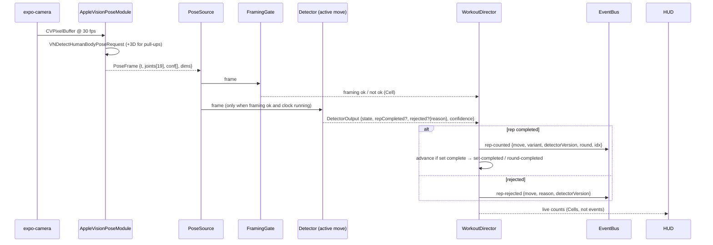
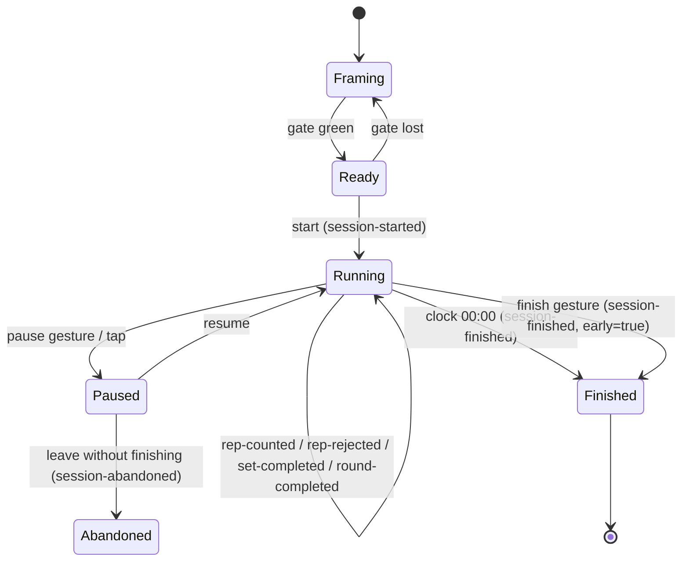
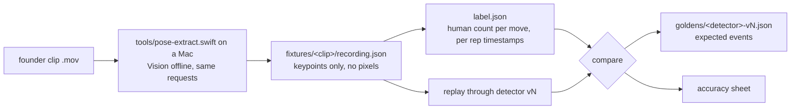

# web-clock (Suit Up) — Architecture

**2026-09-05.** The template delta the tech-lead formalizes after stamp. Sections 1–18
are the design as proposed before code. **Section 19 records where the build departed
from it** — read that first if you are working in `app/`. Product intent: `spec.md`,
`canvases/aso.html`. Tuning loop: `tuning.md`. Store readiness: `store/`.

## 1. What we are building, in one paragraph

A 30-day challenge app whose daily unit is a 20-minute AMRAP of three bodyweight movements
(5 pull-ups / 10 push-ups / 15 air squats, with scaled variants), counted by on-device
Apple Vision from a propped iPhone, scored as rounds + leftover reps, recorded as an
append-only event log, and rendered as a shareable card. It is the template's
event-sourced core plus one native module, one pose seam, four detectors, one director,
one clock, and a handful of projections. It is not a fork of skip-hero's repo; it is the
same pattern with new detectors and a new HUD (decision P4).

## 2. Reuse map

| Layer | Source | Status |
|---|---|---|
| Event definitions, bus, store, projections, entitlements seam | `@factory/core` (`defineEvent`, `InMemoryEventBus`, `InMemoryEventStore`, `persistPublishedEvents`, `defineProjection`, `foldEvents`) | reuse as-is |
| High-frequency live state | `Cell` / `useCell` from `mobile-overlay/src/lib/observable.ts` (ADR 0002) | reuse as-is |
| Composition root | `mobile-overlay/src/context/app-context.ts` | reuse; add pose wiring |
| Brand pack → tokens, identity, features | `template/tools` brand-pack schema, `stamp-app.sh` | reuse; `onboarding.enabled = false` |
| Pose feasibility, 2D vs 3D findings, `pose-extract` offline tool | `apps/pullup/spikes/001`, `002` | fold in |
| Capture → pose → detector → event pipeline shape, fixture replay, goldens | skip-hero pattern (as recorded in pullup spec §2.5 and `docs/marketing/apps/skip-hero.md` §0) | pattern only |
| Native Vision module, detectors, director, clock, challenge projections, HUD, card renderer | **new** | this document |

Do not vendor an Expo app into `template/` (ADR 0003). Do not invent a mutable
`sessions` table (event log is the store of record).

## 3. System context

```mermaid
flowchart LR
  subgraph Phone["iPhone · on-device only"]
    Cam[expo-camera frames] --> NM[AppleVisionPoseModule<br/>Swift · Expo Modules API]
    NM --> PF[PoseFrame<br/>canonical, vendor-free]
    PF --> PS[PoseSource<br/>live | sim | fixture]
    PS --> FG[FramingGate]
    PS --> DET[Detectors<br/>pullup · pushup · squat · variants]
    DET --> DIR[WorkoutDirector]
    CLK[AmrapClock] --> DIR
    DIR -->|domain events| BUS[(EventBus)]
    BUS --> STORE[(EventStore<br/>append-only)]
    BUS --> PROJ[Projections<br/>Session · Challenge · History · Card]
    FG -.cells.-> HUD[Live HUD]
    DIR -.cells.-> HUD
    CLK -.cells.-> HUD
    PROJ --> UI[Screens · Card renderer]
  end
  UI -->|share sheet: PNG/MP4 of keypoints| OS[iOS share]
  BUS -.->|acquisition envelope on every event| AN[Analytics seam]
```

Frames never touch the bus. Footage never leaves the phone. Only keypoints are ever
persisted (as fixtures, opt-in) or rendered (the card).

## 4. Runtime pipeline

### 4.1 One frame



### 4.2 The director's state



The director is pure TypeScript with injected `Clock`/`NewId` (core conventions). It is
the only thing that decides what "a rep in this round of this set" means, so it is the
only thing tested against goldens end to end.

## 5. Events

All events extend `baseEventSchema` via `defineEvent`. Versioned by `detectorVersion`
where a detector produced them. Types are the durable contract; payloads are minimal.

| Type | Payload | Emitted by |
|---|---|---|
| `challenge-started` | `{ challengeId, kind: 'winter-arc-30', startDate, ruleset: { days: 30, minSessionsPerWeek: 5 }, variantPlan }` | ChallengeService |
| `session-started` | `{ sessionId, challengeId?, dayIndex?, workout: 'cindy-20', variants: { pullup, pushup, squat }, targetRounds? }` | Director |
| `rep-counted` | `{ sessionId, move, variant, detectorVersion, round, indexInSet, tMs }` | Director |
| `rep-rejected` | `{ sessionId, move, variant, detectorVersion, reason, tMs }` | Director |
| `rep-added-manually` | `{ sessionId, move, round, tMs }` | HUD (+1) |
| `set-completed` | `{ sessionId, move, round, tMs }` | Director |
| `round-completed` | `{ sessionId, round, tMs }` | Director |
| `session-paused` / `session-resumed` | `{ sessionId, tMs }` | Director |
| `session-finished` | `{ sessionId, rounds, leftoverReps, early, durationMs, framingLostMs }` | Director |
| `session-abandoned` | `{ sessionId, tMs }` | Director |
| `challenge-day-lit` | `{ challengeId, dayIndex, sessionId }` | ChallengeService (fold) |
| `challenge-completed` | `{ challengeId, sessionsCounted, day1Rounds, day30Rounds }` | ChallengeService |
| `card-shared` | `{ sessionId, kind: 'day' \| 'challenge', channel? }` | Share |
| `target-changed` | `{ targetRounds }` | Settings |

`reason` for `rep-rejected` is a closed enum:
`lockout-short | depth-short | chin-below-bar | tempo-too-fast | framing-lost | low-confidence`.
Nothing is silently dropped — a low-confidence rep is a `rep-rejected` with
`low-confidence`, which is what powers the visible "not counted" and the manual +1.

## 6. Detectors

```ts
export interface PoseFrame {
  tMs: number;
  joints: Record<Joint, { x: number; y: number; z?: number; c: number }>; // normalized image coords
  dims: 2 | 3;
  orientation: 'portrait' | 'landscape';
}

export interface DetectorOutput {
  state: string; // detector-specific phase, for the debug HUD
  repCompleted: boolean;
  rejected?: { reason: RejectReason };
  confidence: number; // 0..1, from joint confidences that mattered
}

export interface Detector {
  readonly id: `${Move}-${Variant}-v${number}`;
  readonly requires: Joint[];
  reset(): void;
  step(frame: PoseFrame, ctx: { bar?: BarEstimate; thresholds: Thresholds }): DetectorOutput;
}
```

| Detector | Signal (from pullup spikes + market notes) | Dims | Frame |
|---|---|---|---|
| `pullup-rx-v1` | Elbow angle cycle + `head.y` above `mean(wrist.y)` at top; ignore hips/nose; bar estimated from wrist line while hanging | 3D elbows, 2D head/wrists | ¾ front, bar and full body |
| `pullup-jumping-v1` | Same top condition; relaxed bottom (elbow ≥ 120°); allows feet-driven rise | 2D | same |
| `pushup-rx-v1` | Elbow angle cycle averaged L/R; plank line (shoulder–hip–ankle) as cheat gate; chest-height proxy | 2D | side or ¾, low |
| `pushup-knee-v1` | Elbow cycle; plank line from shoulder–hip–knee | 2D | same |
| `squat-air-v1` | Hip.y oscillation + knee angle; depth = hip below knee (proxy); **2D only** — spike 002 found 3D hips templated | 2D | full body, ¾ |
| `squat-box-v1` | Same with a shallower depth threshold | 2D | same |

Rules: detector outputs carry their `id`; old ids freeze forever; retunes ship as `v2`
alongside. Recompute is "replay the fixture through the new detector", never "edit the
events". Undercount when unsure.

**Accuracy obligation.** Before any frame or clip shows a count, publish a per-detector
accuracy sheet from goldens: counted / missed / false-positive on labelled founder
footage. This is a `[GAP]` today and the single biggest risk in `market-check.md` §9.

## 7. The framing gate

A small pure function over the last N frames: required joints for the *upcoming* move
present with confidence ≥ τ, bounding box within margins, orientation matches. Output is
a `Cell<FramingState>` for the HUD (`ok | lost | too-close | bar-missing`). While the
clock runs and framing is lost, the director keeps the clock running (that is the
sport) but detectors are muted and `framingLostMs` accrues for the summary.

## 8. Clock and cells

`AmrapClock` is a `Cell<number>` of remaining ms driven by a monotonic timer; the
director reads it, the HUD renders it. Live counts (reps in set, current move, round)
are Cells updated by the director on every frame; only the *transitions* become events.
This is ADR 0002 as skip-hero applied it: 30 Hz into Cells, ~1 Hz onto the bus.

## 9. Projections

Pure folds via `defineProjection`; all rebuildable from the log.

| Projection | Fold | Feeds |
|---|---|---|
| `SessionDetail` | per session: rounds, leftovers, per-move totals, rejects by reason, manual adds, framing-lost time | summary screen, day card |
| `ChallengeCalendar` | per challenge: 30 cells with `lit | rest | missed | today`, day-1 vs latest rounds, sessions counted | calendar screen, frame 3 |
| `History` | sessions over time, PB, per-variant PB | history (Pro) |
| `Card` | the share card model: day or challenge, numbers, keypoint replay reference | card renderer |
| `Target` | current target rounds (default 27) | HUD, card |

"A day is lit when the camera saw it": `challenge-day-lit` is emitted by the
ChallengeService when a `session-finished` arrives with `early = false` and at least one
`rep-counted`. Manual-only sessions do not light a day (they are recorded, not lit).

## 10. Native module boundary

`app/modules/apple-vision-pose/` — Expo Modules API, Swift.

```swift
// exported surface, kept tiny
func start(config: PoseConfig)          // fps, want3D: Bool, orientation
func stop()
// events → JS: "pose" { tMs, joints: Float32Array(19*4), dims }
```

- `VNDetectHumanBodyPoseRequest` always; `VNDetectHumanBodyPose3DRequest` only when
  the active detector `requires` 3D (pull-ups). Spike 002: 3D hips/root are templated
  and carry no signal, so squats never request 3D.
- Joint order is fixed and documented once; JS `PoseFrame` is the only vendor-free type.
- Frames are processed on a serial queue; drop-frame policy is "latest wins".
- iOS 17+ target (3D request). No Android in v1; the seam makes MediaPipe a later adapter.

## 11. PoseSource adapters

Selected in the composition root by `EXPO_PUBLIC_POSE=live|sim|fixture`.

- `live` — the native module.
- `fixture` — replays a committed `recording.json` (keypoints only) at wall-clock or
  fast-forward; used by goldens and by Storybook-style HUD development on a Mac.
- `sim` — synthetic sine-wave joints for UI work with no footage.

## 12. Footage → golden path



`npm run check` runs every golden. A detector change that alters a golden must either
bump the version or explain the delta in the PR. The founder's raw clips (promised) are
the first fixtures; until they exist, `sim` and the pullup spike recordings are all we have.

## 13. Storage, entitlements, analytics

- **Store:** v0 `InMemoryEventStore` behind `EventStore`; next a SQLite adapter with the
  same two methods (skip-hero landed this as ADR 0014 there). History cannot be wiped by
  an update because the log is the truth.
- **Entitlements:** `pro` gates `History`, cross-challenge PBs, replay export, extra
  targets. Free: live count, today's card, the 30-day calendar. `StaticEntitlements` in
  dev; RevenueCat adapter behind the seam at Rank 0.
- **Analytics (Gate 0):** every event carries the immutable `acquisition` envelope;
  activation = first `session-finished` with `early=false`; habit = `challenge-day-lit`;
  share = `card-shared`. Installs-per-1,000-views needs AdServices attribution wired
  before the first post (`market-check.md` §6).

## 14. Screens (contract from the listing)

1. **Pick your version** (day 1 only, then a settings row) → variant plan.
2. **Framing gate** → START. First open lands here; no onboarding carousel.
3. **Live HUD** — clock, day/round, current move, reps in set, progress, +1 / PAUSE / FINISH
   (no destructive control in the bottom third during a live set; sweat rule).
4. **Not counted** overlay with reason and a one-tap "+1 · it was clean".
5. **Day card** — rounds + leftovers, day-1 vs today, target bar.
6. **Calendar** — 30 cells; lit / rest / missed.
7. **Share** — skeleton replay card (PNG, optional MP4), no footage.

## 15. Direction-specific deltas (kept, for the record)

The engine is identical across the four directions in `directions.md`. What D (chosen)
adds over the bare engine: `ChallengeService` + `ChallengeCalendar`, variant detectors,
the target bar, and the card. A (Twenty) would have added only `History`; B (Rooftop)
the target and card; C (Strict) reason codes on every reject plus a per-rep replay scrub.
Reason codes ship regardless — they are the trust surface.

## 16. Factory placement and checks

After stamp: quickfire rig `factory:web-clock` in `orchestration/rigs.json`
`factoryApps`. Checks: `npm run check` (lint, typecheck, unit, goldens). EAS only after
promotion. This environment cannot run `factory-run`; the boards and this document live
in the spec repo until the founder says go.

## 17. Non-goals

Cloud pose. A public leaderboard. Android. skip-hero screens or Tile Rush. A tap-only
timer MVP. Film IP on any surface. A mutable sessions table. An onboarding hero.

## 18. Open technical risks, in order

1. **Three moves from one propped placement.** Pull-ups need the bar and a ¾ front;
   push-ups are low and foreshortened; squats need full body. First spike with real clips
   answers whether one placement holds all three or the HUD must cue a reframe once per
   round (which would kill the reveal).
2. **No accuracy figure.** Goldens prove reproducibility, not correctness.
3. **Scaled variants before Rx is tuned.** Oct 1 cohort deadline vs four extra detectors.
   Fallback: ship Rx detectors + a manual scaled mode (`rep-added-manually` heavy) and
   label the card "manual" for those sessions.
4. **Lighting.** WSFU's 1★s say "won't work in anything but great lighting." Framing gate
   must say so before the clock starts, not after.

## 19. As built (2026-09-05, `app/`)

The build follows §3–§14 with these deltas. Where a delta is a scope call it is logged
in `decisions.md` (P8–P11).

| Proposed | Built | Why |
|---|---|---|
| `expo-camera` feeds frames to the module (§3, §4.1) | The module owns its own `AVCaptureSession` (`PoseCaptureSession.swift`) and ships a `PosePreviewView` that shares it. No `expo-camera`. | expo-camera does not hand out `CVPixelBuffer`s without a frame-processor dependency; one session in Swift is smaller and drops frames itself ("latest wins"). |
| 3D request for pull-ups (§10) | 2D only (`VNDetectHumanBodyPoseRequest`). Chin-over-bar is the nose vs the wrist line with `CHIN_MARGIN` in normalised units. | Spike 002 showed 3D adds latency and templated hips; 2D elbow angle plus the chin rule is enough for a first golden. Revisit when founder footage says the chin rule is the weak point. |
| `EXPO_PUBLIC_POSE=live\|sim\|fixture` (§11) | A `poseSourceKind` Cell in the composition root; `live` when the module is present, else `sim`. Debug builds expose the switch in Settings. | A runtime switch lets the same dev build drive the HUD from a fixture on a Mac and from the camera on the phone. |
| `InMemoryEventStore` first, SQLite next (§13) | `SqliteEventStore` on `expo-sqlite` (sync API) from day one; events cached in memory after the first read. | Sessions must survive a relaunch before the founder films with it. |
| Detector output goes straight to the director (§4.1) | The director ignores detector output for `TRANSITION_GUARD_MS = 1500` after a set advances. | Moving bar → floor → stand produces elbow/knee swings that read as reps. Found by the director tests; length is a tuning knob (`tuning.md` §3). |
| `pro` gates History etc. (§13) | `GrantAllEntitlements`; nothing is gated in the build. | P7 says no hard paywall until the *reprice* outcome fires. The seam is in place; RevenueCat lands at Rank 0. |
| Acquisition envelope on every event (§13) | PostHog, anonymous, scalar properties only, no person profiles or replay; envelope not implemented. | AdServices attribution is a store-side task (`store/submission-checklist.md`), not a build blocker. |
| Goldens as `goldens/<detector>-vN.json` (§12) | `fixtures/<move>/<clip>.json` + `<clip>.expect.json` (`counted`, `maxRejects`, `note`); runner `tests/goldens.test.ts`. | One expectation per clip is what a founder can write after watching the clip; per-rep event goldens can be layered on later. |

What exists and passes `npm run check` (typecheck, prettier, 34 tests):

- `src/domain/pose` — `PoseFrame` (19 joints, normalised top-left), angles, `PoseSource`,
  `sim-pose`, `fixture`. Posture, `row`, and the 3D camera grid landed later — see §20.
- `src/domain/detectors` — `CycleMachine` (hysteresis, EMA smoothing, `minRepMs`, count
  at leave-end or return-start), pull-up rx/jumping, push-up rx/knee, squat rx/box,
  `FramingGate` (rolling window, hysteresis, `too-close`).
- `src/domain/workout` — `CINDY`, `AmrapClock` (pause-aware), `WorkoutDirector`
  (framing → ready → running → paused → finished, transition guard, manual +1).
- `src/domain/challenge` + `projections` — `ChallengeService` (lights a day on a full
  session with ≥ 1 counted rep), calendar cells, pace, sessions, PB, settings.
- `modules/apple-vision-pose` — Swift capture + Vision, JS bridge via
  `requireOptionalNativeModule` so the app boots in Expo Go / simulator without it.
- `src/impl` — SQLite store, live/sim/fixture sources, `expo-crypto` ids, PostHog.
- `src/app` — home (landing / calendar / finished), pick, session, summary + share,
  history, settings. `src/design` — tokens from the brand pack, Syne / Inter / Plex Mono.
- `app.json` (iOS 17, camera usage string, privacy manifest, `expo-updates`), `eas.json`,
  icon and splash, `store/metadata/en-US/*`, `store/privacy-policy.md`,
  `store/submission-checklist.md`, `tuning.md`, `tools/pose-extract.swift`,
  `tools/csv-to-fixture.mjs`.

## 20. Posture gate and multi-angle (2026-09-06)

Founder footage showed every elbow-angle cycle looking like every other. The fix is
upstream of the cycle machine:

```
PoseFrame → classifyPosture (relative geometry) → PostureArm → CycleMachine
```

`hang` / `stand` / `plank` / `supine` / `unknown`. Unknown pauses without reset;
a run of mismatches resets so a row set cannot leave a push-up detector half-cycled.
Detector ids bumped to `v2`. `row` is a fourth move; Cindy still uses three.

Angle invariance is `athleteAt(move, depth)` in metres, projected by `CAMERAS`
(front/side/¾/rear × hip/floor). Tests require the same count from every usable
camera and zero cross-talk. A plank filmed from the head (`rear-hip`) is excluded
— it stacks into a stand. A spine-on row is `supine` (stacked hips), not a hang.

AI-generated video from a reference clip is the wrong golden source (compounded
anatomy error). It can still produce listing or demo footage. The loop for a new
angle is: add a camera to `CAMERAS`, or film a real clip and cut a fixture.

Offline debug videos (skip-hero loop): `tools/debug-video.sh` traces every detector
over a fixture and `tools/debug-render.swift` burns skeleton, posture, counts, and
the elbow/knee strip onto a copy of the source clip. See `tuning.md` §2c.
